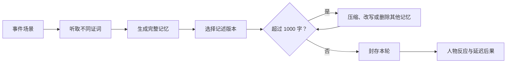

# 《千字村》首轮版本叙事与交互设计

## 1. 文档目的

本文档把《千字村》的核心概念推进为可制作、可测试的叙事玩法方案，重点回答三个问题：

1. 15 回合讲述一段怎样的完整故事；
2. 玩家如何参与故事，而不是旁观事件或机械整理卡片；
3. 文字编辑如何稳定地改变人物关系、村庄知识和集体信仰。

本文档不是完整剧本，也不包含最终对白。下一阶段应以此为基础制作纸面原型和事件数据表。

## 2. 已锁定的首轮版本范围

- 仅支持中文；
- 单局 15 回合，覆盖村庄约 30 年；
- 首次通关目标时长为 25～30 分钟；
- 6 名主要角色；
- 约 20～25 段可管理记忆，其中包括开局旧记忆和本局新记忆；
- 每段记忆提供完整版本和 2 个改写版本；
- 使用人工编写的事件、记忆和条件分支；
- 不提供自由输入，不使用生成式人工智能；
- 以生存知识、人物关系、村庄信仰为三个底层系统；
- 提供 3～4 种村庄结局，以及模块化人物尾声；
- 支持自动保存、重新开始和查看历代《村志》。

## 3. 设计命题

《千字村》不是关于如何保存最多信息，而是关于谁有权决定一种怎样的过去继续存在。

玩家每次修改文字，都应同时产生三类影响：

- 功能影响：村庄是否还知道如何应对灾难；
- 社会影响：某个人是否仍被感谢、信任或承认为村民；
- 解释影响：村庄把过去理解为事实、共同责任还是先祖传说。

当三类价值无法同时保留时，核心玩法才会产生真正的两难。

## 4. 世界规则与玩家身份

### 4.1 千字碑

村庄中央有一块只能容纳一千个汉字与标点的石碑，称为「千字碑」。

发生过的事情不会因为没有写在碑上而立即消失。亲历者仍会保留私人记忆，但未被刻入碑中的细节会在数年内依次经历：

1. 记忆变得模糊；
2. 不同说法彼此冲突；
3. 当最后一名亲历者离去后，只剩碑文版本；
4. 碑文如果已经改写，改写后的说法会逐渐成为全村共同记忆。

这一规则允许当事人质疑碑文，也能解释删除或改写为何会产生延迟后果。

### 4.2 守字人

玩家扮演新任「守字人」。守字人负责听取证词、整理碑文和主持每次封存仪式，但不能直接命令村民。

村民依据千字碑上仍然存在的知识、关系和信仰自行作出决定。守字人的权力很大，却始终是一种间接权力。

序章由上一任守字人留下规则：

> 碑不裁断真假。碑只让留下的说法继续活下去。

## 5. 玩家参与故事的四种方式

### 5.1 决定官方说法

每次事件由 2～3 名角色给出不同证词。证词不是额外的选择题，而是记忆改写版本的叙事来源。

例如，同一场救援可以被写成：

- 阿禾救下柳木；
- 祁生提前发现洪水征兆；
- 村民共同渡过灾难；
- 先祖显灵，使洪水退去。

玩家选择的不只是短句，而是谁的说法获得公共权威。

### 5.2 管理一千字容量

新事件默认生成完整记录。封存本轮前，玩家可以：

- 保留完整记录；
- 改写为两个不同意义的短版本之一；
- 删除旧记忆；
- 在字数超限时继续修改其他记忆。

封存当前回合前允许撤销。封存后，完整记录不能恢复；已经压缩的记忆以后只能继续保留或删除。

### 5.3 接受人物托付

全局设置 4 次「托付」事件。角色会明确请求守字人保留某段记忆。

玩家可以接受或拒绝。接受托付不会额外消耗资源，但该记忆会带有一个红线标记。如果玩家后来压缩或删除它，当事人会作出反应；如果当事人已经去世，则由其他角色在结局中提及这次失约。

托付系统只改变对白、关系和人物尾声，不引入新的数值资源。

### 5.4 在高潮前宣读一段记忆

第 13 回合开放一次性操作「开碑宣读」。玩家从现存记忆中选择一段，在全村面前公开宣读。

宣读不会恢复已经失去的内容，但会临时放大该段记忆对村民决策的影响。这是玩家在最终灾难前最直接的一次行动，同时仍然服从「文字改变世界」的核心机制。

## 6. 主要角色

| 角色 | 开局年龄 | 身份 | 代表的记忆价值 | 主要人物弧线 |
|---|---:|---|---|---|
| 阿禾 | 17 | 摆渡人 | 行动、勇气、个人功劳 | 从冲动少年成长为英雄、领袖或被遗忘的普通人 |
| 柳木 | 38 | 木匠 | 建造、名誉、感恩 | 是否记得阿禾的救命之恩，是否把公共工程视为个人功业 |
| 杜衡 | 32 | 药师 | 精确知识、证据 | 冗长药方能否传给下一代，还是只留下「神医」之名 |
| 祝婆 | 67 | 祭者、旧事见证人 | 传统、村庄起源 | 起初维护传说，临终前承认传说本身也是一次改写 |
| 祁生 | 24 | 上游逃难者、水工 | 外来知识、身份归属 | 成为村民、功劳被夺、遭到驱逐或在终局拯救村庄 |
| 小满 | 8 | 柳木之女、杜衡学徒 | 下一代、玩家行为的见证者 | 从听故事的孩子成长为下一任守字人 |

### 6.1 重点关系

- 阿禾救过柳木，柳木是否记得这件事取决于碑文；
- 杜衡教小满辨药，精确药方决定知识能否越过个人生命；
- 祝婆起初不承认祁生，后来发现村庄先祖同样是被接纳的外来者；
- 祁生与阿禾共同治水，碑文可以把成果归给个人、集体或先祖；
- 小满持续观察守字人的选择，最终继承一种关于记忆的立场。

## 7. 故事主线

故事围绕三个相互连接的问题展开：

1. 村庄能否记住应对周期性洪水的知识；
2. 外来者祁生能否成为被公共记忆承认的村民；
3. 村庄是否愿意承认，最神圣的开村传说本身就是一次压缩和改写。

三条线在最后一次大洪水中汇合。村庄如何准备、由谁带领、谁愿意救谁，以及灾后如何解释牺牲，都由千字碑上的现存内容决定。

## 8. 15 回合叙事结构

### 第一幕：文字似乎只是记录，回合 1～3

#### 回合 1：东桥洪水

- 时间：第 0 年；
- 事件：暴雨冲垮东桥。刚从上游逃来的祁生发现水位刻痕异常，阿禾驾船救下柳木；
- 玩家参与：听取阿禾、柳木和祁生的不同描述，形成第一段新记忆；
- 记忆冲突：保留洪水预警方法、阿禾功劳，还是强调集体互助；
- 后续用途：影响阿禾与柳木的关系、祁生的可信度和最终洪水预警。

这一回合不强迫删除旧记录，只介绍多版本记述。

#### 回合 2：无籍之人

- 时间：第 1 年；
- 事件：祁生请求留在村中，但千字碑上没有他的来历；
- 玩家参与：决定碑文称其为「上游来客」「水工祁生」还是「村民祁生」；
- 记忆冲突：事实谨慎、实用身份与公共归属；
- 后续用途：决定祁生是否能参加议事、是否容易成为灾难替罪者。

祁生提出第一次直接问题：

> 如果碑上不肯叫我村民，我在这里活多少年才算留下？

玩家回答只影响祁生对守字人的态度，真正的公共身份仍由碑文决定。

#### 回合 3：苦草之方

- 时间：第 3 年；
- 事件：村中出现热病，杜衡用复杂药方救下数人，并开始教小满辨药；
- 玩家参与：选择保留精确药方、杜衡的医者名声，或将治愈解释为祭河仪式的结果；
- 记忆冲突：可传承知识、个人权威与宗教解释；
- 后续用途：第 9 回合的热病直接检查此处留下的内容。

### 第二幕：每个名字都开始占用空间，回合 4～6

#### 回合 4：重修东桥

- 时间：第 5 年；
- 事件：柳木主持重建东桥，阿禾和祁生共同参与；
- 玩家参与：三人分别提出碑文版本；
- 记忆冲突：工程方法、主持者姓名、共同劳动；
- 后续用途：影响里正人选，以及终局时谁有资格指挥撤离。

本轮第一次稳定触发千字碑超限，玩家必须修改一段旧记忆。

#### 回合 5：祝婆的旧歌

- 时间：第 7 年；
- 事件：祝婆唱出未刻在碑上的旧歌。歌中说明村庄先祖也是逃难者，曾被一群已经失去姓名的人接纳；
- 玩家参与：决定把它写成完整历史、简短原则「来者亦可为村民」，还是继续保留先祖征服洪水的神话；
- 记忆冲突：事实、公共伦理与凝聚力；
- 后续用途：影响祁生的身份，以及村庄对最终灾难的解释。

祝婆提出第一次托付：保留「先祖也曾是外来者」这一事实。

#### 回合 6：粮仓大火

- 时间：第 9 年；
- 事件：粮仓因湿粮发热起火。祁生打开风道，阿禾组织搬运，柳木认为起火源于外来者改动仓体；
- 玩家参与：在相互冲突的证词中决定责任与功劳；
- 记忆冲突：火灾知识、祁生功劳、维持村庄团结；
- 后续用途：影响祁生是否被信任，以及第 10 回合的身份审判。

### 第三幕：碑文开始替人作出决定，回合 7～9

#### 回合 7：新里正

- 时间：第 11 年；
- 事件：旧里正去世，村民依据碑中记录选择继任者；
- 系统结果：
  - 阿禾的个人功劳突出时，阿禾被推为里正；
  - 柳木被记录为桥与粮仓的主要功臣时，柳木当选；
  - 集体叙事占主导时，村庄成立议事会；
  - 崇祖倾向过强时，祝婆获得实际决策权；
- 玩家参与：不能直接指定里正，只能记录新任者的誓言；
- 叙事目的：第一次明确证明「过去的写法正在替现在投票」。

#### 回合 8：祝婆辞世

- 时间：第 13 年；
- 事件：祝婆临终说出七个原始接纳者的名字，但完整记录会占用大量字数；
- 玩家参与：保留全部姓名、保留其中一人、改写为「无名者收留先祖」，或完全删除；
- 记忆冲突：具体的人、抽象的道德原则、现有生存知识；
- 后续用途：改变祝婆尾声、祁生归属和小满对守字人的评价。

祝婆提出第二次托付：至少留下一个真实姓名。

#### 回合 9：热病重来

- 时间：第 15 年；
- 事件：更严重的热病爆发，杜衡本人首先病倒；
- 系统结果：
  - 精确药方仍在时，小满能够独立配药；
  - 只留下杜衡名声时，村民等待杜衡醒来，延误治疗；
  - 只留下祭河传说时，村民先举行仪式；
  - 药方与师徒关系都存在时，小满会公开感谢杜衡；
- 玩家参与：记录谁救了村庄，以及付出了怎样的代价；
- 叙事目的：让玩家体验知识、人物名声和信仰解释之间的区别。

### 第四幕：历史成为现实中的权力，回合 10～12

#### 回合 10：谁算村民

- 时间：第 18 年；
- 事件：歉收引发争执，祁生被指责占用粮食和土地；
- 系统结果：
  - 「村民祁生」仍在碑上时，他拥有发言资格；
  - 粮仓功劳仍在时，有人替他辩护；
  - 「先祖也是外来者」仍在时，祝婆的旧歌成为支持依据；
  - 三者都不存在时，祁生被驱逐；
- 玩家参与：记录审判结果，不能凭空改变此前形成的公共身份；
- 后续用途：祁生是否参与第 11 回合的水文发现和最终防洪。

祁生提出第三次托付：如果必须让他离开，至少不要把他写成纵火者。

#### 回合 11：河床石痕

- 时间：第 20 年；
- 事件：河水异常退去，河床露出旧刻痕。祁生或小满发现大洪水约每三十年重临一次；
- 玩家参与：选择保留完整测量、简短预警，或将石痕解释为先祖预兆；
- 记忆冲突：准确性、字数效率与信仰动员力；
- 后续用途：决定第 13 回合能否提前撤离，以及村民是否愿意相信预警。

#### 回合 12：碑会说谎吗

- 时间：第 22 年；
- 事件：已经长大的小满发现亲历者记忆与碑文互相矛盾；
- 玩家参与：回答小满的问题；
- 可选立场：
  - 「碑应当尽量留下事实」；
  - 「碑首先要让村庄活下去」；
  - 「碑留下什么，什么就会成为事实」；
- 系统影响：不改变世界数值，只影响小满的后续对白、继承方式和结局旁白；
- 叙事目的：让玩家明确表达自己在此前选择中形成的立场。

小满提出第四次托付：不要让下一任守字人只继承结论，也要知道碑曾被改写。

### 第五幕：村庄成为它所记得的样子，回合 13～15

#### 回合 13：水退得太远

- 时间：第 25 年；
- 事件：河水再次异常退去，最终洪水即将到来；
- 系统结果：村民根据现存知识、当前里正和主导信仰提出不同方案；
- 玩家参与：使用一次「开碑宣读」，从现存记忆中选择一段公开宣读；
- 可能影响：强化撤离、筑堤、救援、祭河或排斥外来者等方案；
- 叙事目的：让玩家主动调用自己留下的历史，而不只是等待系统结算。

#### 回合 14：决堤之夜

- 时间：第 26 年；
- 事件：大洪水抵达，东桥和旧堤同时面临崩塌；
- 系统结算：
  - 生存知识决定是否提前撤离和如何分配人手；
  - 人物关系决定谁会冒险救谁；
  - 身份记录决定村民是否救助祁生及其家人；
  - 村庄信仰决定危机中服从经验、领袖还是仪式；
  - 第 13 回合宣读的记忆改变某一项决策权重；
- 玩家参与：灾后必须记录这一夜。新记录内容很多，会迫使玩家最后一次大规模删改旧记忆；
- 叙事目的：把所有系统汇聚为人物命运，而不是显示一组结算分数。

#### 回合 15：传碑

- 时间：第 30 年；
- 事件：小满准备接任守字人，请玩家最后整理千字碑；
- 玩家参与：
  - 阅读当前完整碑文；
  - 进行最后一次不可逆整理；
  - 选择一句结语；
  - 将千字碑交给小满；
- 结局内容：洪水结果、村庄形态、6 名人物尾声、最终《村志》和「碑外残响」。

「碑外残响」只向玩家展示曾经存在但已经被删除的名字和片段。村民无法看见这些内容。

## 9. 单回合交互流程

### 9.1 事件场景

- 显示年份、地点和参与人物；
- 使用 2～4 段短对白呈现立场冲突；
- 不通过旁白提前宣布哪一种说法正确；
- 重要证词可以在编辑页面再次查看。

### 9.2 千字碑编辑

- 顶部固定显示当前字数，例如 `972 / 1000 字`；
- 左侧保留本轮事件摘要和人物诉求；
- 中间显示按年代排列的记忆卡；
- 右侧显示选中记忆的完整版本和两个改写版本；
- 每个版本显示准确字数与自然语言影响提示；
- 底部提供「撤销本轮修改」和「封存本年」。

影响提示不显示数值，使用以下表达：

- 「保留河水预警方法」；
- 「将抹去阿禾救过柳木的记录」；
- 「可能增强村民对先祖仪式的信任」；
- 「祁生将不再被碑文称为村民」。

### 9.3 封存反馈

封存后先展示人物对新碑文的即时反应，再进入下一回合。重要的延迟后果通过「记忆回声」说明：

> 第 0 年，碑上原本写着：
> 「阿禾驾船救下柳木。」
>
> 第 5 年，这句话被改为：
> 「村民共同渡过洪水。」
>
> 第 11 年，柳木已经不再记得自己为何曾经信任阿禾。

「记忆回声」应指向具体改写，不使用「关系值下降」之类的系统提示。

## 10. 记忆卡的数据结构

每张记忆卡至少包含：

- 记忆标识；
- 发生年份；
- 完整文本与字数；
- 两个改写版本与字数；
- 被每个版本保留或删除的事实标签；
- 相关人物；
- 关系影响；
- 信仰影响；
- 可触发的未来事件；
- 是否属于人物托付；
- 即时反馈文本；
- 延迟后果文本。

示例：

| 版本 | 文本方向 | 保留标签 | 删除或改变的内容 |
|---|---|---|---|
| 完整记录 | 祁生预警，阿禾救人，第三刻痕撤离 | 洪水预警、祁生可信、阿禾救柳木 | 无 |
| 实用节录 | 只保留第三刻痕撤离 | 洪水预警 | 删除人物功劳与关系 |
| 英雄记述 | 阿禾独自救人 | 阿禾英雄、阿禾救柳木 | 删除预警知识和祁生功劳 |

任何短版本都不能在所有方面优于长版本。两个短版本之间必须代表不同价值，而不是一长一短的效率差异。

## 11. 叙事节奏

每 3 回合设置一次明显情绪转折：

- 回合 3：第一次意识到知识会因为写法不同而失传；
- 回合 5：发现开村传说本身已经被改写；
- 回合 8：第一次面对死亡与姓名的字数成本；
- 回合 10：碑文决定一个人是否属于村庄；
- 回合 14：所有选择汇聚为具体人物的生死与救援；
- 回合 15：玩家亲手留下最终村庄版本。

事件不能连续使用灾难制造压力。洪水、疾病和火灾之间应穿插建桥、收徒、选举、托付和身份争论，让人物先形成日常关系，再承担损失。

## 12. 结局结构

结局不采用单一好坏分数，而由四层结果组合：

1. 生存结果：伤亡与村庄损失；
2. 村庄形态：务实、互信、崇祖或失名；
3. 人物尾声：6 名角色的身份、关系和去向；
4. 最终文本：玩家留下的一千字《村志》。

暂定四种主结局：

- 「坚存之村」：知识完整，村庄安全，但许多人物功劳和情感已经消失；
- 「众人之乡」：村民记得彼此，也愿意互救，但部分技术细节已经失传；
- 「先祖之村」：传说提供秩序和团结，同时取代了复杂事实；
- 「无名之村」：不断删除争议使村庄保持平静，也使其逐渐失去共同身份。

主结局只定义村庄倾向，不能覆盖洪水结果和人物命运。同一个主结局内部仍应存在明显差异。

## 13. 叙事与参与度验证

纸面测试和数字原型需要分别记录以下问题：

### 13.1 故事理解

- 测试者能否说出祁生为何被接纳或驱逐；
- 测试者能否理解祝婆旧歌与村庄开村传说的关系；
- 测试者能否解释最终洪水至少两个关键结果的来源。

### 13.2 玩家参与感

- 测试者是否认为村庄是由自己的碑文选择塑造，而不是由固定剧情决定；
- 第 7 回合里正结果是否被理解为此前选择的后果；
- 第 13 回合「开碑宣读」是否产生主动介入高潮的感觉；
- 测试者是否记得至少一次接受或违背人物托付。

### 13.3 情感效果

- 单局是否至少出现 3 次超过 10 秒的明显犹豫；
- 结束后能否指出一段最不愿删除的记忆；
- 结束后能否说出一次后悔的改写；
- 是否愿意为了另一种《村志》开始第二局。

### 13.4 通过标准

- 80% 的关键后果能够被正确归因；
- 多数测试者认为至少一名角色的命运与自己的选择直接相关；
- 不存在超过 70% 测试者稳定采用的单一压缩策略；
- 首次完成时间处于 20～40 分钟；
- 至少一半测试者主动表达重玩意愿。

## 14. 下一阶段产物

接下来不应立即扩写全部对白。应按以下顺序继续：

1. 制作 6 名角色的详细角色卡和关系变量表；
2. 把 15 回合转换成事件节点表，列出前置条件与后果；
3. 先完整编写回合 1～5 的记忆卡及全部改写版本；
4. 用纸面卡片进行一次 5 回合内部测试；
5. 根据测试结果调整字数压力、因果提示和人物诉求；
6. 核心选择成立后，再扩写回合 6～15。

首个可验证里程碑不是「故事写完」，而是测试者在第 5 回合面对超限时，是否愿意为了一个人的名字牺牲一段实用知识。
